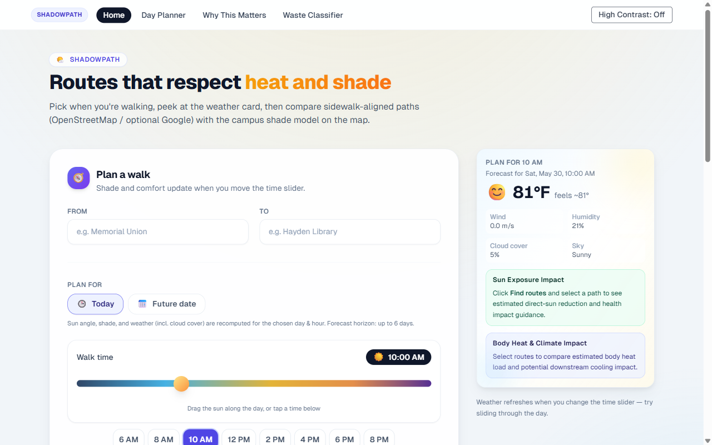
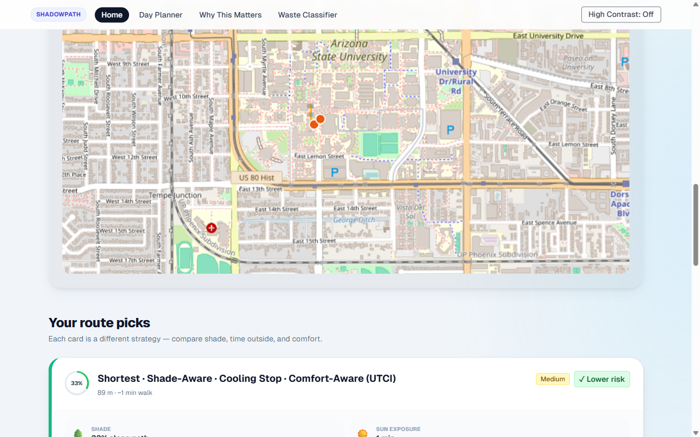
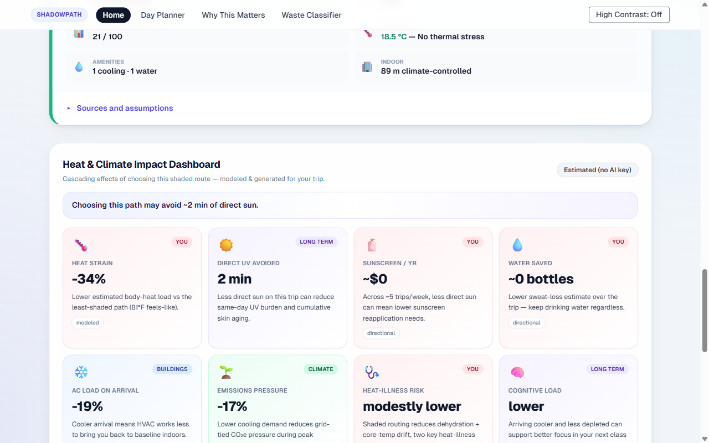
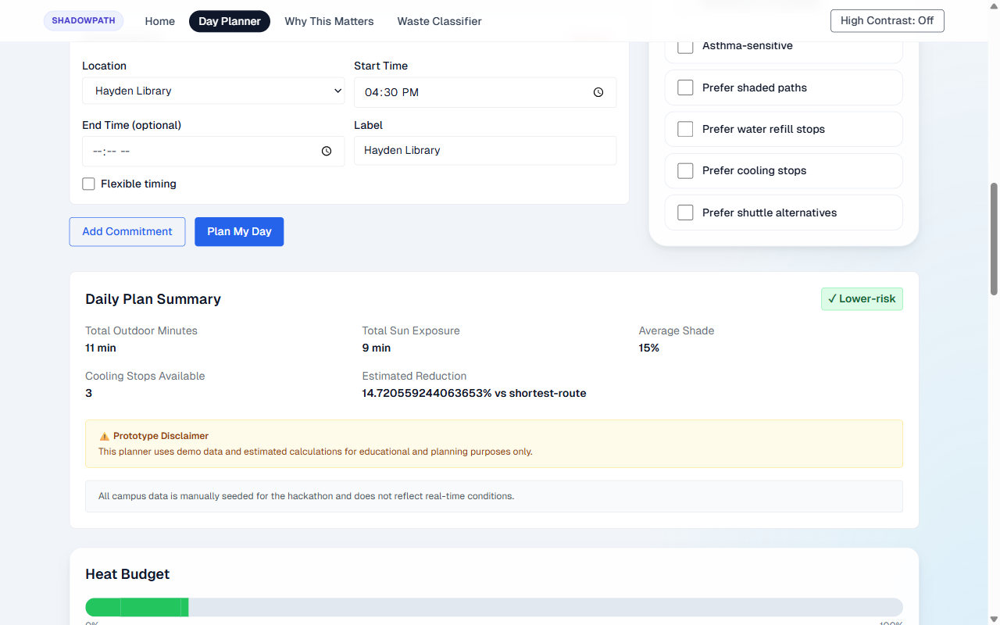
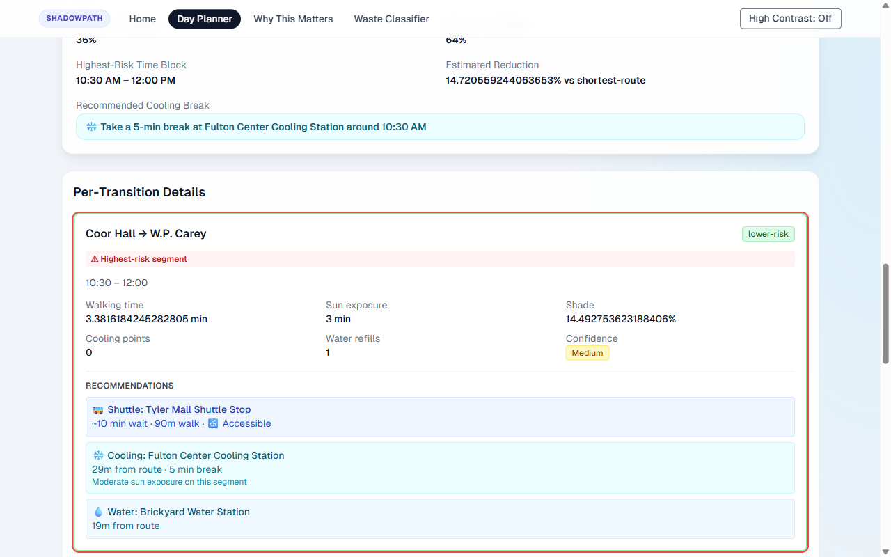
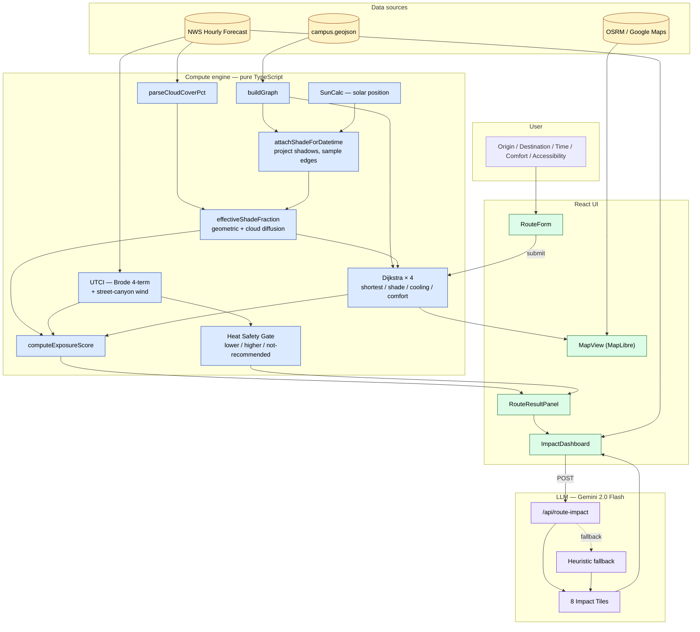

# ShadowPath

**Shade-aware campus routing for ASU Tempe — because the shortest path and the coolest path are rarely the same.**

[](https://shade-path.netlify.app)
[](https://nextjs.org)
[](https://typescriptlang.org)
[](https://vitest.dev)

---

## Overview

ShadowPath routes pedestrians across the ASU Tempe campus using real shade geometry, live weather, and four parallel routing strategies. Enter where you're going and when — the app computes which path minimizes sun exposure, shows the thermal comfort index (UTCI), and explains the downstream cascade of that small choice on your body, the building's AC, and the Phoenix grid.

The **HeatShield Planner** extends this to full-day scheduling: enter 2–5 campus commitments and get per-leg heat-risk analysis, a daily heat budget, shuttle alternatives for high-risk segments, and cooling/water stop recommendations.

Built for the **Kiro Spark Challenge (Environment Accountability Guardrail)** using a spec-first workflow: requirements → design → tasks → property-based tests.

---

## Preview

### Route Planner



*The form auto-fetches NWS weather for your chosen hour. The weather card updates as you slide through the day.*



*Four route strategies rendered as overlays. Teal lines follow real pedestrian geometry from OSRM; faded colored lines show the campus shade/UTCI model.*

### Impact Dashboard



*Eight impact tiles trace the cascade from your walk to your body, the building's AC, and grid CO₂e. Powered by Gemini 2.0 Flash with a built-in heuristic fallback.*

### HeatShield Day Planner



*Daily Plan Summary with a heat budget bar, highest-risk time block, and estimated reduction vs. shortest-route-only planning.*



*Per-transition cards highlight the riskiest segment and surface actionable alternatives: shuttle stops, cooling stations, water refills.*

---

## Highlights

- **Time-travel shade geometry.** Shade is computed from actual building footprints, heights, and tree canopies using SunCalc for *any* chosen datetime — past or future. November at 5 PM casts different shadows than April at 5 PM, and the optimal route changes accordingly.
- **Cloud-aware scoring.** NWS short-forecast text ("Mostly Sunny", "Thunderstorms") is parsed into a cloud-cover percentage that narrows the gap between shaded and unshaded routes on overcast days — most routing tools ignore this entirely.
- **Four Dijkstra variants on one graph.** Shortest, shade-aware, cooling-stop, and comfort-aware (UTCI-weighted) routes all run over the same edge graph with different cost functions. Same algorithm, different signal — no duplicate infrastructure.
- **UTCI thermal comfort, not arbitrary thresholds.** Heat safety verdicts use the international WHO-endorsed Universal Thermal Climate Index with a street-canyon wind correction, producing "lower-risk / higher-risk / not recommended" labels grounded in Brode et al. (2012).
- **LLM as translator, not oracle.** The compute engine produces hard numbers from physics. Gemini 2.0 Flash only turns those numbers into a readable narrative across eight impact categories. A built-in heuristic fallback ensures the dashboard never goes empty if the API key is missing.
- **Spec-driven + property-based tested.** 30 correctness properties (P1–P14 routing, P1–P16 planner) are verified with fast-check, running 100 random iterations each. Accessibility correctness is verified with jest-axe.

---

## Use Cases

| Use Case | User | Outcome |
|---|---|---|
| Pre-trip route comparison | Student crossing campus at 2 PM | Picks the shade-aware route and arrives 3°C cooler |
| Full-day schedule planning | Student with 4 classes spread across campus | Identifies the highest-risk walk and takes the shuttle instead |
| Accessibility routing | Wheelchair user | Filters to wheelchair-accessible paths only, including accessible entrances |
| Future-day planning | Anyone planning a week ahead | Picks a datetime up to 6 days out; NWS forecast + sun geometry adapts |
| Climate awareness | Sustainability-minded user | Sees the AC load and CO₂e pressure avoided by choosing shade |

---

## Features

### Routing
- **4 strategies:** Shortest, shade-aware, cooling-stop, comfort-aware (UTCI-weighted)
- Time-of-day shade slider (6 AM – 8 PM, 5-minute steps)
- Today mode or future date mode (up to 6 days, driven by NWS forecast)
- Wheelchair-accessible filtering with accessible-entrance detection
- Configurable comfort vibe: fastest / balanced / coolest (tunes UTCI cost weights)
- Real sidewalk polylines from OSRM (or Google Maps with API key)

### Scoring & Safety
- UTCI computed per edge with street-canyon wind correction
- Exposure score (0–100): duration × heat × shade − cooling stops
- Heat Safety Gate: lower-risk / higher-risk / not recommended (never "safe")
- Confidence labels (High / Medium / Low) based on data coverage
- Cloud-aware effective shade fraction (NWS forecast text → cloud pct → diffusion factor)

### Impact Dashboard
- 8 tiles: heat strain, UV avoided, sunscreen, water saved, AC load, emissions, heat-illness risk, cognitive load
- Physical thermodynamic proxies: body kcal absorbed → HVAC Wh saved → grid CO₂e
- Gemini 2.0 Flash narrative with heuristic fallback
- Campus-scale extrapolation (10 k daily trips)

### HeatShield Day Planner
- 2–5 campus commitments → N−1 per-transition heat-risk cards
- Visual heat budget: consumed vs. remaining, color-coded by risk
- Highest-risk segment identification with explanation
- Shuttle alternative recommendations (stop, wait, distance, wheelchair flag)
- Cooling break and water refill recommendations
- 8 personal heat mode preferences (low exertion, asthma-sensitive, prefer shuttle, etc.)

### Accessibility & Quality
- Wheelchair path filtering with ARIA-labeled controls
- High-contrast theme (custom Tailwind `hc:` variant, ≥7:1 contrast)
- Keyboard-navigable, screen-reader-friendly route summaries
- Responsible language: risk labels never use the word "safe"
- Prototype disclaimer and methodology transparency page

---

## Tech Stack

| Layer | Technology | Purpose |
|---|---|---|
| Framework | Next.js 14 App Router | Server + client routing, API routes |
| Language | TypeScript 5 | End-to-end type safety |
| Styling | Tailwind CSS + custom `hc:` variant | Design system + high-contrast mode |
| Map | MapLibre GL | Interactive route overlays |
| Geometry | Turf.js | Shadow projection, point-in-polygon, edge sampling |
| Solar position | SunCalc | Azimuth + altitude for any lat/lng/datetime |
| Weather | NWS Hourly Forecast API | Live temp, humidity, wind, cloud cover (server-proxied) |
| Walking routes | OSRM (public) / Google Maps (optional) | Real pedestrian sidewalk polylines |
| LLM | Google Gemini 2.0 Flash | Impact tile narrative generation |
| Testing | Vitest + fast-check + jest-axe | Unit, property-based, accessibility |
| Data | Static GeoJSON + optional OSM Overpass refresh | ASU Tempe campus graph |

---

## Architecture



---

## How It Works

1. **You pick a trip and a time.** Origin, destination, time-of-day slider (or a future calendar date). Weather is fetched from the National Weather Service for that exact hour.

2. **Shadows are projected.** SunCalc computes the sun's azimuth and altitude for your datetime. Building footprints + heights cast shadow polygons; tree canopies cast offset circles. Each path edge is sampled at 12–120 points — each point is tested for shadow containment.

3. **Clouds blur the advantage.** NWS forecast text ("Mostly Sunny") is mapped to a cloud-cover percentage. Heavy cloud cover collapses the shade gap, because diffuse light hits everything. The effective shade fraction accounts for this.

4. **Four Dijkstra variants run.** Shortest (distance), shade-aware (maximize shadow), cooling-stop (prefer AC buildings + misting), and comfort-aware (UTCI-weighted blend). Duplicate paths are merged.

5. **UTCI and the Heat Safety Gate evaluate each route.** Temperature, humidity, wind, mean radiant temperature, and a street-canyon wind correction feed into the Brode 4-term UTCI approximation. Routes are labeled lower-risk / higher-risk / not recommended.

6. **Gemini turns the numbers into a story.** Route stats are sent to `/api/route-impact`; the LLM returns eight categorized impact tiles. If the API is unavailable, the heuristic fallback fills identical tiles from physics formulas. The dashboard never stays empty.

---

## Setup

**Prerequisites:** Node.js 18+

```bash
# Install dependencies
npm install

# Start development server
npm run dev
```

Open [http://localhost:3000](http://localhost:3000). Core routing works without any API keys, using the static `campus.geojson` dataset and NWS weather (public, no key required).

**Optional extras — add to `.env.local`:**
```env
GOOGLE_MAPS_API_KEY=...   # better sidewalk polylines (falls back to public OSRM)
GEMINI_API_KEY=...        # LLM impact tiles (falls back to heuristic computation)
```

**Refresh building/tree data from live OpenStreetMap:**
```bash
npm run generate-data -- --force --live
```

**Build for production:**
```bash
npm run build && npm start
```

---

## Usage

### Single Route

1. Enter **Origin** (e.g., `Memorial Union`) and **Destination** (e.g., `Hayden Library`)
2. Drag the time slider or press a quick preset (6 AM – 8 PM)
3. Click **Find routes** — four strategies appear on the map with shade %, UTCI, and safety verdict
4. Toggle **Wheelchair-accessible paths only** to filter for accessible edges
5. Switch to **Future date** to plan up to 6 days ahead

### Day Planner

1. Navigate to **Day Planner**
2. Click **Load Demo Schedule** for a prebuilt 4-commitment day, or enter your own
3. Toggle Personal Heat Mode preferences (low exertion, prefer shuttle, etc.)
4. Click **Plan My Day** — per-transition risk cards, heat budget, and recommendations appear
5. Review the highest-risk segment explanation and any shuttle/cooling alternatives

---

## Key Decisions

| Decision | Rationale | Tradeoff |
|---|---|---|
| Static GeoJSON + optional OSM refresh | Works offline, zero infrastructure, deterministic tests | Campus data becomes stale; refresh script requires Overpass access |
| Four Dijkstra variants on one graph | Same algorithm, different cost functions — easy to test and extend | Priority-queue splice insertion is O(n); fine for campus scale, not city-scale |
| NWS forecast text → cloud-cover integer | Public API, no key, 7-day horizon, parses reliably across forecast phrases | Coarse mapping (0/25/50/75/100%) loses nuance vs. a proper cloud sensor |
| Gemini for narrative, not computation | LLM output is non-deterministic; keeping physics in pure TS makes the app testable and auditable | Two-call latency when API key is present; heuristic fallback bridges the gap |
| UTCI Brode 4-term approximation | Publishable, monotonic, fast — adequate for routing in the Phoenix heat range | Full 200-coefficient ISB regression exists but adds no meaningful accuracy at this scale |
| "Never say safe" language policy | CDC heat guidance; TypeScript union type enforces only `lower-risk \| higher-risk \| not recommended` | Some users may find softer language less actionable |
| Property-based tests with fast-check | Routing invariants (shade monotonicity, budget conservation, N−1 transitions) are hard to cover with examples alone | Longer CI runtime (~74 s for 100-run property sweeps) |

---

## Innovation / Notable Work

**Time-travel shade** is the core differentiator. Most "find shade" tools use a static snapshot or a fixed time-of-day. ShadowPath recomputes full shadow geometry for any requested datetime using actual building footprint + height data plus SunCalc's solar position. This means the same route from Memorial Union to Hayden Library will give you a genuinely different shade percentage in October vs. April, and at 10 AM vs. 2 PM.

**Cloud-aware diffusion model** closes a gap that urban routing tools consistently ignore. Phoenix summer days go from blazing clear to 40% overcast in an hour. Without accounting for cloud cover, a shade-aware router would always push you down the same shaded street even when diffuse sky radiation makes the alternative just as cool. The NWS text parser + diffusion factor resolves this without needing a sky sensor.

**The thermodynamic chain** in the Impact Dashboard runs from individual metabolic kcal absorbed, through HVAC COP, to campus-scale kWh and grid CO₂e. Each step uses a physical formula (First Law of Thermodynamics, US grid carbon intensity), not a lookup table. The numbers are directional estimates, not accounting claims — but the chain is traceable and the methodology is documented.

**Full-day planner as an additive module.** HeatShield Planner was built without modifying a single existing file in the routing engine. All new logic lives in `lib/planner/` and `components/planner/`. The planner reuses the same Dijkstra variants, UTCI scoring, and exposure formulas — it only adds the scheduling, budget, and recommendation layers.

---

## Quality

| Area | What's covered |
|---|---|
| Unit tests | Dijkstra correctness, exposure scoring, UTCI math, shade geometry, weather parsing, validation |
| Property-based tests | 30 correctness properties (fast-check, 100 runs each): shade monotonicity, budget invariants, N−1 transitions, wheelchair filter, comfort weights |
| Accessibility tests | jest-axe automated WCAG audits on all route form and result components |
| Type safety | Strict TypeScript; risk level is a union type — compiler enforces "no safe label" policy |
| Heuristic fallback | Impact Dashboard renders meaningful output even with no API key |
| Error boundaries | Dataset load errors, weather fetch failures, and routing failures each surface clear UI messages |

**Run the suite:**
```bash
npm run test:run    # full pass (~156 tests)
npm run test        # watch mode
```

---

## Research Grounding

- **UTCI** — Brode et al., 2012. WHO-endorsed thermal comfort metric; 4-term polynomial approximation used here.
- **SunCalc** — Mourner, BSD-2. Solar position for any lat/lng/datetime.
- **NWS Hourly Forecast API** — Official US National Weather Service, ~7-day horizon.
- **Phoenix urban heat island** — Hondula et al., ASU Center for Urban Climate Research.
- **Heat illness epidemiology** — CDC heat-related illness guidance informs the "not recommended" threshold rationale.

---

## Project Structure

```
src/app/                  # Next.js pages + API routes
  api/
    weather/              # NWS proxy with date+time params
    route-impact/         # Gemini impact tiles + heuristic fallback
    impact-insights/      # Gemini health bullets
    walking-directions/   # OSRM / Google Maps proxy
lib/
  graph/                  # Campus graph builder (nodes, edges, footprints, trees)
  routing/                # Dijkstra + 4 strategies + exposure score + safety gate
  shadow/                 # Sun-driven shade geometry (SunCalc + Turf)
  weather/                # NWS client + cloud-cover parser
  comfort/                # UTCI computation + edge comfort
  walking/                # Polyline decoding + shade sampling along real paths
  planner/                # HeatShield day planner (transitions, budget, recommendations)
data/campus.geojson       # ASU Tempe static dataset
components/               # React UI components
  planner/                # Day Planner components
hooks/                    # useRoutes, useWeather, useDayPlanner
__tests__/                # Vitest + fast-check + jest-axe
.kiro/specs/              # Spec-driven workflow artefacts (requirements, design, tasks)
```

---

## About

ShadowPath started from a simple observation: every navigation app optimizes for time or distance, but in Phoenix in July, walking 3 minutes in direct sun at 2 PM is meaningfully worse than walking 5 minutes in shade. The project explores what a routing app looks like when thermal comfort is a first-class routing signal — and what that small individual choice, multiplied across a campus of 70,000 people, actually means for energy and emissions.

Built end-to-end using the Kiro spec-driven workflow. The full spec artefacts live in `.kiro/specs/`.
